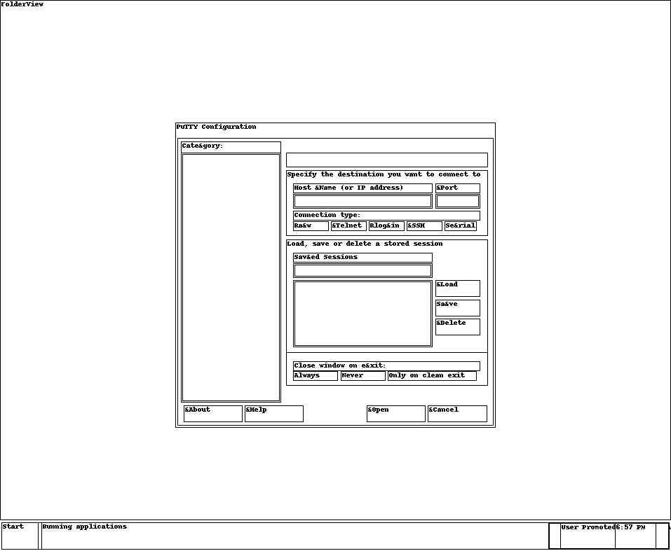

# Агентство: Write-up

Леденящая душу история с леденящим материальные ценности жидким азотом намекает на то, что перед нами — дамп оперативной памяти некоторой системы. Для работы с дампами существует инструмент volatility. Для начала узнаем, с каким же файлом мы имеем дело:

```
$ volatility -f dump.raw imageinfo
Volatility Foundation Volatility Framework 2.6
INFO    : volatility.debug    : Determining profile based on KDBG search...
          Suggested Profile(s) : Win7SP1x86_23418, Win7SP0x86, Win7SP1x86_24000, Win7SP1x86
          ...
```

Итак, это дамп памяти Windows 7. Сразу сделаем две полезные вещи: распечатаем список процессов и попросим volatility нарисовать псевдо-скриншот происходившего на экране.

```
$ volatility -f dump.raw --profile Win7SP1x86_23418 pslist
Volatility Foundation Volatility Framework 2.6
Offset(V)  Name                    PID   PPID   Thds     Hnds   Sess  Wow64 Start                          Exit                          
---------- -------------------- ------ ------ ------ -------- ------ ------ ------------------------------ ------------------------------
...
0x83a974c0 pageant.exe            2780   1364      8      240      1      0 2021-03-27 01:56:03 UTC+0000                                 
0x84c48b20 putty.exe              2948   1364      6       87      1      0 2021-03-27 01:56:18 UTC+0000                                 
...

$ volatility -f dump.raw --profile Win7SP1x86_23418 screenshot --dump-dir .
...
Wrote ./session_1.WinSta0.Default.png
...
```



Итак, _агент_ готовился подключиться куда-то по SSH с помощью стандартного для Windows средства — программы putty. Также загружен процесс pageant — он нужен для того, чтобы хранить в памяти приватные ключи, чтобы не нужно было при каждом подключении их искать, а также вводить пассфразу, если ключ ей зашифрован.

Вытащим отдельно дампы памяти по каждому из процессов.

```
$ volatility -f dump.raw --profile Win7SP1x86_23418 memdump --dump-dir . -p 2780,2948
Volatility Foundation Volatility Framework 2.6
************************************************************************
Writing pageant.exe [  2780] to 2780.dmp
************************************************************************
Writing putty.exe [  2948] to 2948.dmp
```

Для начала разберёмся с putty. «Скриншот» не отражает, в частности, уже введённых, согласно описанию задания, цифр. Но раз они уже были введены, то они явно есть где-то в памяти процесса. Поищем в памяти процесса IP-адреса в текстовом виде, увидим кучу повторов и повторим поиск, отсортировав результаты с удалением этих повторов:

```
$ strings 2948.dmp | grep -E '^[0-9][0-9]?[0-9]?\.[0-9][0-9]?[0-9]?\.[0-9][0-9]?[0-9]?\.[0-9][0-9]?[0-9]?$' | sort -u
0.0.0.0
1.0.0.0
10.0.0.0
...
6.1.1.76
6.16.1.7
85.119.82.176
```

Внимательно смотрим на то, что нашлось. Куча коротких однородных строчек, скорее всего, означает что-то другое, среди них хорошо выдляется единственный IP-адрес: **85.119.82.176**.

Где-то в памяти процесса находится и номер порта. Однако его так просто не найти. Но можно его и не искать, а просто найти открытые порты сканированием:

```
$ nmap -p- 85.119.82.176
...
PORT      STATE SERVICE
53/tcp    open  domain
80/tcp    open  http
113/tcp   open  ident
443/tcp   open  https
2000/tcp  open  cisco-sccp
4369/tcp  open  epmd
5222/tcp  open  xmpp-client
5269/tcp  open  xmpp-server
5280/tcp  open  xmpp-bosh
36524/tcp open  febooti-aw
38156/tcp open  unknown
40404/tcp open  sptx
43193/tcp open  unknown
```

Имя пользователя мы знаем из задания: `agent`. Можно попробовать перебрать разные порты. На двух из них будет адекватный для SSH ответ:

```
$ ssh agent@85.119.82.176 -p 40404
agent@85.119.82.176: Permission denied (publickey).
$ ssh agent@85.119.82.176 -p 43193
agent@85.119.82.176: Permission denied (publickey).
```

При подключении необходимо указать ключ. Но где его взять? Конечно, в памяти процесса pageant. Попробуем поискать прочитанный файл ключа в исходном виде. Согласно [спецификации формата ключей для PuTTY](https://tartarus.org/~simon/putty-snapshots/htmldoc/AppendixC.html#ppk-outer), там обязательно должен быть заголовок PuTTY-User-Key-File. Поищем его и рядом стоящие строки. В памяти процессов найти ничего не удаётся, но файл, похоже, закешировался при чтении операционной системой, поэтому в дампе мы наблюдаем его весь:

```
$ strings public/dump.raw | grep 'PuTTY-User-Key-File' -A46
PuTTY-User-Key-File-2: ssh-rsa
Encryption: none
Comment: imported-openssh-key
Public-Lines: 12
AAAAB3NzaC1yc2EAAAABIwAAAgEAmk0P20crDrTvMVSzCBi+4npsbxLKTJoR9PAU
DkFD7RjREJcc6Heva4ifbbY0JcjrqDXvDVxWqqbxORGwWi4mDQ/yJu861De+12ig
IGdolldUvYtsKwnlvu81AkRs6+KQ/fGFw/wb80es3MhZJ2F+JXoUoBLccj4uob2o
yk5dsI41KY92ZWFj8EmW8sjTtEXYg00ic8nFBOvuzLZOVD91wjwy+pqTI1Gisws2
ttQCMyyEtN5bXrQ3wP545VpyfM7RrjjjHdLHuxrk5Ex/hg9WH/wjE7m1YT/FvBfv
ae5yGLtBq+ZxHvjfIl7kHHpervNLFbbUd4JQbfBSwxVF2gkK/lmjw/y1hQc9yEAm
iNB7+rOUdBkWWDS82ISQIuYpVPi/4Mpi50R2QjWBODzxzKB8Ho/RZrb7v7qE70Xy
w1WFQrBX77EOfAc8tOD84BWxklnqrIxqW6LtOaNYdSHLVqtRgLr8DI+4g/MnsY/q
EyQyIQ38wYXne4X0BZQQ7+Twi+31fJpjn/B8HVZ2BQdvQzib6CtpjrbZQv3IfdcM
K2TMbvim3J2QHrcSxMQg1e8Svea05aqfJVg5l/z13sbwvkQQLwsvkcwS39AkboMQ
9vxVQdQpSOSOir3IsZN39WbejPyvCOfC0h+9psXMjnyZOkwygO9xvE2tPgb54tJX
nBlRr4M=
Private-Lines: 28
AAACAQCV5HXNstlevmSzlBuhdx/UsXCmagZZCrJbp2PwlywK5OhZQlaYrseqSjR5
NKevrTyyCIHSdvUazg7m+z2Zbqie+Ywl0nOplT0LxLjPBV5I5x8eh3BkUsHsrdu5
D0U86ri8LHNQq8NhW5H7C8RSJDFmPBQJNuTGwBAK1X9lcLLIxKisB7TXgy3iG5nz
KX0yx4HeorPA7+P2JwU75EwXU5b3Myo1RbOBZT73EjUmohDD/1xX7fJb/4aeOQe6
OpsaJ/7jwju2kj5d/N5aHm1AZqtvhzgEiIRP14zimuiSymA1SDEqpVfyM5buMEtO
3UYJCZlljQjpH4FU2tQN92htZ97JsFHw/w2RQohOpwvbP0P50t0O6tAFlynVxeUi
t0iDKbfwILmXmZ7azJFaNRuD5RS8W6f3+h5sqAc1zY9ysvpVt4k6uuOhFrO0dLDy
TJaNubo3jB4PPufeua4S/7LZ9zyO19UQTEnKAr10/pNL1XvgueFi2JA5cfdBOLC1
38gNUt2tlH3FoRKpsbbCSNviNG1l3cjPs/2WSslQY4A5DfVchE57OiWxE3PUga3K
PenAoFZhB7wLOnFCtV9Xcwl68zN2FSsQ6RgVYZ1T0YduXQNYv7H6M/jGfaXdoc06
55X4BfSY9emN8J5Ka1gtWjMXaviK8lqZJ/4JCEt16owTBZXuWwAAAQEAydy/3TIi
UxsCNCy6drE3WtI72pQ9eo04TeJP2eL/0tGJcBLcl7GRAhw6L1Rzgp3tdq3BZqTa
0Rg3EH4y3uBD9QNXEpiShNV1d8u1yPKVp+T7iyBPtUsQMs+IWvRfNFIiWHy5hkQU
9QFzv21mASc1YqqAZQmK9tezIFDLLUEFJOiUFxgls1NyDkqzmgQ54HJYNPhOxs3c
1darbdFk/KVIQExM22gusBkSYlTkxsUy4+EtWSmkk+sKTJuSs5s6s4+IWQi68pT5
z9FWdnFeeubqCf3RiCV5xOOHiRpUGqyLW6TrBcQYkWScQ4605PZuFTg9zlOQZvpN
5Hi2q99SbS221QAAAQEAw67mZEC2lUspyW2Z1OarlkgSTMoU+O342+eYuQM3igtY
ogl2JTfA6Fbk9RAVG3YFydieg5Hth7+meG/0vmcP587cKV5pVHIFpcZO/efFJ4nD
HjopaRziR/tgv57a2l8lsX5Y2QpbRp9yjjBXiwtmN0SXnEl5MGGPT/stQkN5Ed1q
iI3FYqSEIEmJbbXcuMgBdARqICwAJkC0XSe42ciw5NyYb7XX3FzQGIn7UfsIe+Q2
UQbAgJ259aVT77yyLLyeFNTcB6jfDMe6PHYQTtvWyJnmvX+P8AW21L8R1kTNmuit
mY5NFqcJMduMydedhRiG62aOPYfIuBVf8UJyU5Eo9wAAAQAUb3oh8P9+HVvVVK31
FmAPeh6p5gwBpjSH5ga/S2vFHcuGGwjDgAWQ9I1FSZLc7v4SeEGKlsUH5NTyeRVT
3E+EWantj7Kgf00WnifWoeyDs+jHt45w6N16vF2QLSeWwiVqk+EqXhb3NC/4uBpj
74BjPp7Hmc9PQg7dPgi5AoOW9P0JRgTPfiFho/V52cFdNxwpgCmsrNe0pmRi4t54
VnkE0w3+nkd18JkNuUMvY99EjjzWWESLz8forMcwBKE6WNcCDa90yy8hfiWiZERW
EKi7RK5rYvcqpO0RB/Mq1WqagGd9u25/IaB4vj9fXq0CPBoBtMcvoEju2xZPMXEO
ApSi
Private-MAC: 8ef469ea75ba35276599b60e2d73f1a538ec27f0
```

Для удобства сделаем из этого ключа приватный ключ в формате OpenSSH.

```
$ puttygen agent-key.ppk -O private-openssh -o agent-key
```

Пробуем подключиться. На порту 40404 нас спрашивают секрет, после чего выдают флаг.

```
$ ssh agent@85.119.82.176 -p 40404 -i agent-key
Your secret?
```

Флаг: **ugra_agents_of_a_feather_duck_together_6f0d32d3647a**
