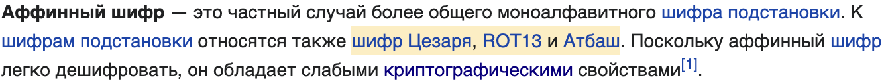

# Японский шифр: Write-up

Видим типичный для югорских юниорских соревнований по информационной безопасности сайт на японском языке. Внимательно его читаем. Воображаемый японский друг рассказывает об аффинных преобразованиях — в частности, об аффинных шифрах.

Аффинные шифры — это когда алфавит кодируется последовательностью чисел, и для шифрования применяется обратимая математическая функция. Наш друг сетует на то, что аффинные шифры редко когда применяются для японской письменности (наверняка на это есть причина), и по этому поводу предлагает нам шифртекст на японском, полученный как раз таким шифром.

## Собираем зацепки

Увидев задание, а также две надписи ウツツガ！(яп. *уцуцуга*) по бокам страницы, понимаем, что, чтобы понять, как расшифровывается текст, нужно цепляться за всё, за что в принципе возможно. Благо, подсказок и намёков много. Вот они все:

1. Шифр аффинный.
2. Используется Хирагана (набор иероглифов для слоговой записи незаимствованных японских слов).
3. Используется *традиционный* порядок Хираганы (это у нас с вами алфавит — «А, Б, В, Г, ...» — у японцев всё не так однозначно).
4. Порядок алфавита определяется стихотворением.
5. Шифр довольно известный.
6. В самом низу страницы присутствует изображение маскота, который, во-первых, очень похож на гротескного стереотипного еврея, а во-вторых, его зовут Матисьяху.
7. В нумерованном списке внизу страницы вместо цифр — иероглифы: い (и), ろ (ро), は (ха).
8. В CSS-стилях нумерованного списка есть свойство: `list-style: hiragana-iroha;`.

## Применяем дедукцию

### Алфавит

Сперва определимся с алфавитом. Зацепки №2, №3, №4 и №6 позволяют найти ответ в интернете. А зацепки №6 и №7 прямо в лоб говорят, что алфавит — это стихотворение «Ироха», которое знаменито тем, что содержит в себе каждый символ Хираганы, причём ровно по одному разу, и в прошлом использовалась для определения порядка иероглифов.

Запрос «iroha ordering table» в средней поисковой системе в числе первых возвращает [ссылку на Викисловарь](https://en.wiktionary.org/wiki/Appendix:Hiragana_script), где искомый алфавит удобно набран в строку:

```
いろはにほへとちりぬるをわかよたれそつねならむうゐのおくやまけふこえてあさきゆめみしゑひもせす
```

Думаем дальше.

### Шифр

Аффинных шифров много. Широко известных — меньше. Знаменитых — ещё меньше. Тех, которые указывают в качестве примера в статье на русской Википедии, всего три:



Атбаш выделяется на фоне двух других шифров своей еврейской историей. Вот и всё, собственно.

## Расшифровывем текст

Суть шифра Атбаш в том, что первая буква по алфавиту становится последней, вторая — предпоследней, и так далее.

Берём любимый язык программирования и пишем пару строчек, чтобы расшифровать текст, оставляя символы не из алфавита (переносы строк и что-нибудь ещё, что могло бы гипотетически попасться, но не попалось):
```python
def atbash(text):
    ciphertext = ""
    for c in text:
        if c in ALPHABET:
            c = (ALPHABET[::-1])[ALPHABET.index(c)]
        ciphertext += c
    return ciphertext
```

Получаем три строчки почти осмысленного японского (это хаику, но с опечатками, чтобы уместилось в алафвит). Сдаём их на сайт и выигрываем.

Флаг: **ugra_i_is_to_ro_as_ro_is_to_ha_814c8d629b9de3e9**
